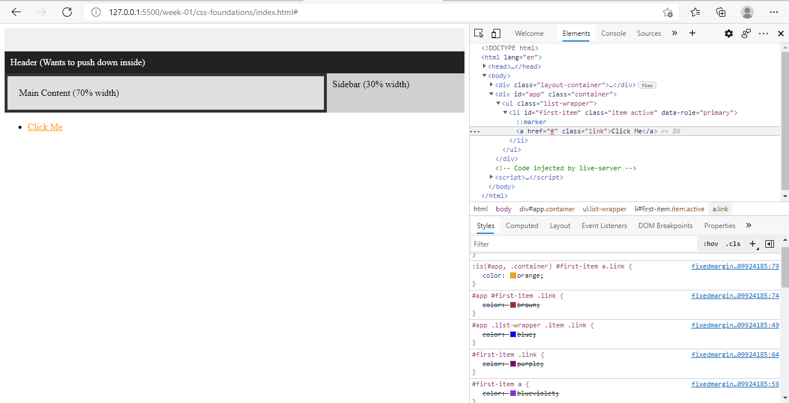

When the browser evaluates multiple CSS rules targeting the same element, it calculates a specificity score for each selector to determine which rule should be applied.

The specificity score is represented as a three-component vector (A, B, C):

A = Number of ID selectors (#app, #first-item)
B = Number of class selectors, attribute selectors, and pseudo-classes (.link, [data-role], :hover)
C = Number of element selectors and pseudo-elements (div, ul, li, a, ::before)

The 8 CSS rules used for this exercise are defined in fixedmargincollapse.css.

Rule	Specificity
Rule 1	(0, 0, 1)
Rule 2	(1, 3, 0)
Rule 3	(0, 3, 3)
Rule 4	(1, 0, 1)
Rule 5	(1, 1, 0)
Rule 6	(0, 3, 3)
Rule 7	(2, 1, 0)
Rule 8	(2, 1, 1)
Predicted Result

Based on the calculated specificity scores, Rule 8 is expected to win because it has the highest specificity (2, 1, 1), consisting of:

2 ID selectors
1 class selector
1 element selector

Therefore, Rule 8 overrides all other competing rules targeting the same element.

Verification

The prediction was verified using the browser's DevTools, where the Styles panel confirmed that Rule 8 was the applied CSS rule.

      